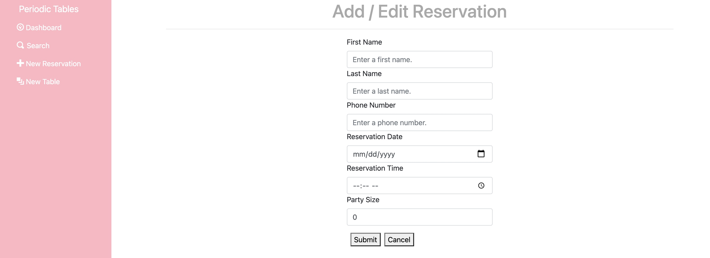
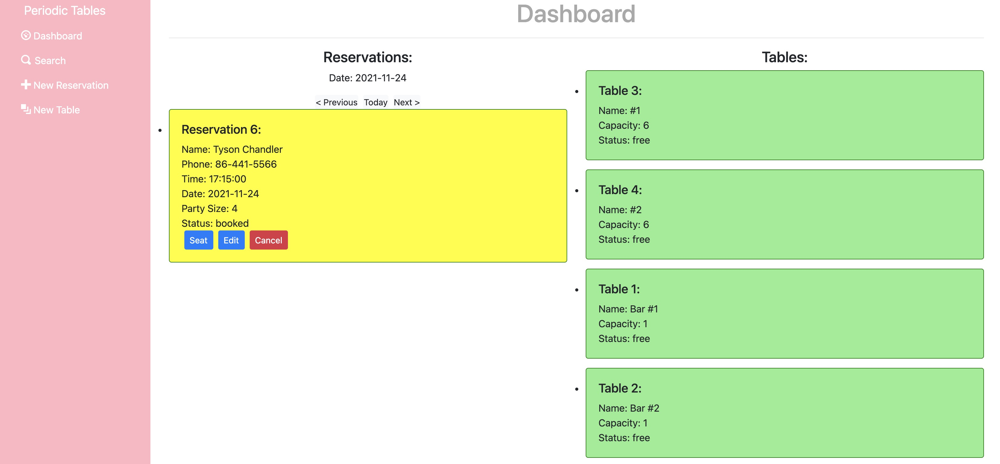
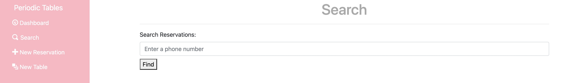
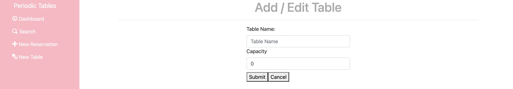
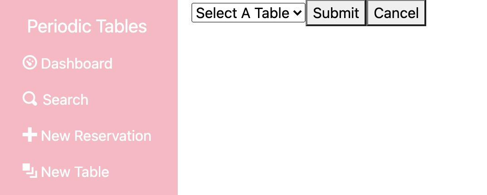

## Periodic Tables: Restaurant Reservation App
Live Front-end Application: https://jg-reservation-app-client.herokuapp.com/dashboard

Live API: https://jg-reservation-app-server.herokuapp.com/

## Summary:
Web application that gives the user (a restaurant employer/employee) the ability to create, edit, and delete information related to reservations and tables at a given restaurant. This app delivers significant utility to the user by providing a clean, easy-to-navigate interface that allows for seamlessly and efficiently keeping track of day-to-day restaurant operations.

## Technology Used:
Javascript, CSS, React.js, Express.js, Node.js, Knex.js, Bootstrap, POSTGREsql, Nodemon, Heroku, DBeaver

## Documentation:
Get/add reservations: 
https://jg-reservation-app-server.herokuapp.com/reservations

Get reservation by ID:
https://jg-reservation-app-server.herokuapp.com/reservations/:reservationId

Update reservation status:  
https://jg-reservation-app-server.herokuapp.com/reservations/:reservationId/status

Edit reservation:  
https://jg-reservation-app-server.herokuapp.com/reservations/:reservationId/edit

Get all tables/add table: 
https://jg-reservation-app-server.herokuapp.com/tables

Get table by ID: 
https://jg-reservation-app-server.herokuapp.com/tables/:tableId

Seat guests (remove reservation from table):  
https://jg-reservation-app-server.herokuapp.com/tables/:tableId/seat

## Screenshots:

## Installation

1. Fork and clone this repository.
1. Run `cp ./back-end/.env.sample ./back-end/.env`.
1. Update the `./back-end/.env` file with the connection URL's to your ElephantSQL database instance.
1. Run `cp ./front-end/.env.sample ./front-end/.env`.
1. You should not need to make changes to the `./front-end/.env` file unless you want to connect to a backend at a location other than `http://localhost:5000`.
1. Run `npm install` to install project dependencies.
1. Run `npm run start:dev` to start your server in development mode.